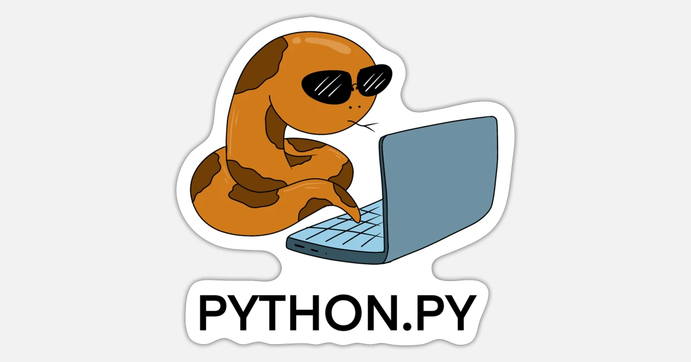

# Python Basics Repository



This repository serves as a learning resource for fundamental Python concepts. 🐍 It covers a range of topics, including syntax, data types, control structures, functions, object-oriented programming (OOP), web requests using the 'requests' library, and file handling.

## Getting Started

### Prerequisites

Make sure you have Python installed on your system. If not, you can download it from [python.org](https://www.python.org/).

### Running the Code

1. Clone this repository:

    ```bash
    git clone https://github.com/Kir-Khorev/python-base.git
    ```

2. Navigate to the project directory:

    ```bash
    cd python-basics
    ```

3. Run the Python scripts:

    ```bash
    python index.py
    ```

Feel free to explore the code and experiment with different concepts covered in the repository.

## Contents

- [Basics of Python](index.py): Introduction to Python syntax, data types, and control structures.
- [Functions](functions.py): Examples of defining and using functions.
- [Object-Oriented Programming](oop.py): Implementation of classes, inheritance, encapsulation, and polymorphism.
- [Web Requests](web_requests.py): Demonstrates making HTTP requests using the 'requests' library.
- [File Handling](file_handling.py): Examples of reading from and writing to files.

Feel free to contribute by submitting issues or pull requests.

Happy coding! 🚀

## Author

- [@Kir Khorev](https://github.com/Kir-Khorev)